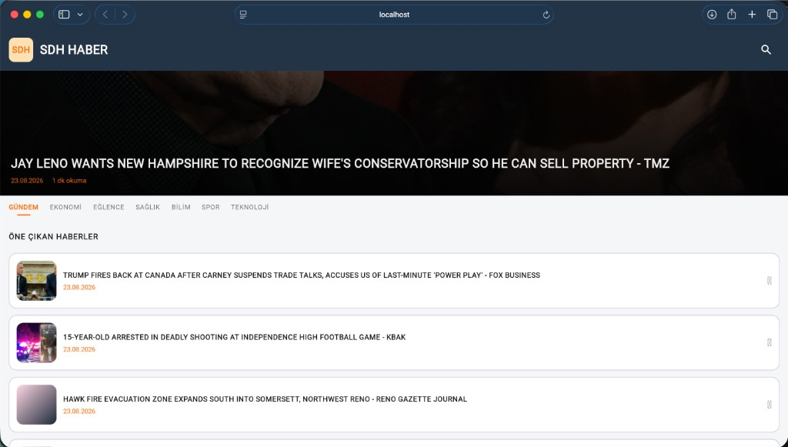

# KMPNews

News client for **SDH — Son Dakika Haber**. Shared Kotlin business logic with **native SwiftUI on iOS** and **Compose Multiplatform** on Android, Desktop, and Web.

---

## Platform UI Strategy

| Platform | UI | Shared from Kotlin |
|----------|----|--------------------|
| **Android** | Jetpack Compose (CMP) | UI + ViewModels + domain/data |
| **Desktop** | Compose Desktop (CMP) | UI + ViewModels + domain/data |
| **Web** | Compose Wasm (CMP) | UI + ViewModels + domain/data |
| **iOS** | **SwiftUI** (native) | ViewModels + domain/data + networking |

## iOS native UI layout

SwiftUI screens live under `app/iosApp/iosApp/Features/` (Xcode target). Kotlin iOS bridge code lives in each feature's `presentation/src/iosMain/` and is exported through the `IosApp` framework.

```
feature/home/presentation/src/iosMain/   → HomeViewModelController, snapshots
feature/detail/presentation/src/iosMain/ → DetailViewModelController, snapshots

app/iosApp/iosApp/
  Features/Home/     HomeView.swift, HomeViewModelWrapper.swift
  Features/Detail/   DetailView.swift, DetailViewModelWrapper.swift
  App/               ContentView.swift, AppCoordinator.swift
  DesignSystem/      KMPNewsTheme.swift, RemoteImageView.swift
```


## Screenshots

<table>
  <tr>
    <td align="center" valign="top" width="50%">
      
      <br /><br />
      <b>iOS</b>
    </td>
    <td align="center" valign="top" width="50%">
      
      <br /><br />
      <b>Android</b>
    </td>
  </tr>
</table>

<table>
  <tr>
    <td align="center" valign="top" width="50%">
      
      <br /><br />
      <b>Web</b>
    </td>
    <td align="center" valign="top" width="50%">
      
      <br /><br />
      <b>Desktop</b>
    </td>
  </tr>
</table>

---

## Features

- **iOS:** native SwiftUI with shared Kotlin ViewModels
- Shared Compose UI on Android, Desktop, and Web
- Category tabs: general, business, entertainment, health, science, sports, technology
- Article detail with hero image, metadata, summary, and full content
- Headline carousel on the home screen
- Remote images via Coil 3
- Material 3 theme with SDH brand colors, light and dark mode
- TR / EN strings through Compose Multiplatform Resources
- Feature modules (`contract`, `domain`, `data`, `presentation`) with Koin
- Navigation 3 with a user-owned back stack and per-destination ViewModels

---

## Tech Stack

| Category | Technology |
|----------|------------|
| Language | Kotlin **2.4.10** |
| UI | Compose Multiplatform **1.11.1**, Material 3 |
| Architecture | Clean / layered architecture, MVVM |
| DI | Koin **4.2.2** |
| Networking | Ktor Client **3.5.2**, kotlinx.serialization |
| Images | Coil **3.5.0** (Ktor network fetcher) |
| Navigation | Navigation 3 **1.1.1** (`NavDisplay`, `NavKey`, `rememberNavBackStack`) |
| Lifecycle | AndroidX Lifecycle **2.9.6** (ViewModel, runtime-compose, viewmodel-navigation3) |
| Data | Room 3, SQLite, Multiplatform Settings |
| Localization | Compose Resources (`composeResources`) |
| Build | Gradle **9.x**, AGP **9.0.1**, Convention Plugins (`build-logic`) |
| Targets | Android (minSdk 24), iOS (Arm64 / Simulator), JVM Desktop, Web (Wasm GC) |

---

## Architecture

The app uses a modular structure that separates responsibilities per feature:

```
┌──────────────────────────────────────────────────────────────┐
│  app/androidApp · app/iosApp · app/desktopApp · app/webApp   │
│         Android/Desktop/Web: Compose entry                   │
│         iOS: SwiftUI + IosApp Kotlin framework bridge        │
└──────────────────────────────┬───────────────────────────────┘
                               │
┌──────────────────────────────▼───────────────────────────────┐
│  app/shared          KmpNewsApp, Koin, KmpNewsNavHost        │
│  app/ui-components   KmpNewsTheme, design system             │
└──────────────────────────────┬───────────────────────────────┘
                               │
          ┌────────────────────┼────────────────────┐
          ▼                    ▼                    ▼
┌───────────────┐    ┌───────────────┐    ┌───────────────────┐
│ feature/home  │    │ feature/detail│    │ core/*            │
│ contract      │    │ contract      │    │ network, domain,  │
│ domain        │    │ domain        │    │ navigation, db... │
│ data          │    │ data          │    │                   │
│ presentation  │    │ presentation  │    │                   │
└───────────────┘    └───────────────┘    └───────────────────┘
```

**Data flow (Home):**

`HomeScreen` → `HomeViewModel` → `HomeNewsUseCase` → `HomeRepository` → `HomeApi` → News API `/v2/top-headlines`

**Data flow (Detail):**

`DetailScreen` → `DetailViewModel` → `GetArticleDetailUseCase` → `DetailRepository` → cached home feed / News API

**Navigation flow:**

`ViewModel` → `NavigationManager` → `NavBackStack` → `NavDisplay` → feature `NavEntryProvider`

Each feature registers its own `@Serializable` destinations and screen entries through Koin. Navigation state is saveable across configuration changes and process death on all KMP targets.

---

## Project Structure

```
KMPNews/
├── app/
│   ├── androidApp/       # Android application module
│   ├── desktopApp/       # Desktop (JVM) application module
│   ├── iosApp/           # SwiftUI app + Kotlin bridge (ViewModels, Koin)
│   ├── webApp/           # Web (Kotlin/Wasm) application module
│   ├── shared/           # Shared entry point (KmpNewsApp, Koin)
│   └── ui-components/    # Theme, typography, shared UI components
├── core/
│   ├── model/            # Shared models
│   ├── domain/           # Result types, use case base
│   ├── network/          # Ktor HttpClient, News API config
│   ├── database/         # Room / SQLite
│   ├── datastore/        # Settings (Multiplatform Settings)
│   ├── navigation/       # NavigationManager, KmpNewsNavHost, NavEntryProvider
│   └── presentation/     # CoreViewModel, shared presentation helpers
├── feature/
│   ├── home/             # Home feed, categories, headlines
│   └── detail/           # Article detail screen
├── build-logic/          # Gradle convention plugins
└── docs/screenshots/     # README screenshots
```

---

## Requirements

- **JDK 11+**
- **Android Studio** Ladybug or newer (for Android)
- **Xcode 15+** (for iOS, macOS only)
- **News API key** — free registration at [newsapi.org](https://newsapi.org/register)

---

## Setup

1. Clone the repository:

```bash
git clone https://github.com/<username>/KMPNews.git
cd KMPNews
```

2. Configure your News API key:

Update the `API_KEY` value in `core/network/src/commonMain/kotlin/com/example/kmpnews/core/network/config/NewsApiConfig.kt`.

3. Sync the project:

```bash
./gradlew tasks
```

---

## Running the App

### Android

```bash
./gradlew :app:androidApp:installDebug
```

Or run the `app/androidApp` module from Android Studio.

### Desktop

```bash
./gradlew :app:desktopApp:run
```

Hot reload (when supported):

```bash
./gradlew :app:desktopApp:hotRun --auto
```

### iOS

1. Open `app/iosApp/iosApp.xcodeproj` in Xcode
2. Select a simulator or physical device
3. Run

Build via Gradle:

```bash
./gradlew :app:shared:embedAndSignAppleFrameworkForXcode
```

### Web

Requires a browser with [Wasm GC](https://webassembly.org/features/): Chrome 119+, Firefox 120+, or Safari 18.2+.

```bash
./gradlew :app:webApp:wasmJsBrowserDevelopmentRun
```

The app opens at `http://localhost:8080/`. News API calls are proxied through `/news-api` so the browser can talk to News API without CORS errors.

Production artifacts:

```bash
./gradlew :app:webApp:wasmJsBrowserDistribution
```

Output: `app/webApp/build/dist/wasmJs/productionExecutable`

The host must serve `.wasm` as `application/wasm` and send COOP/COEP headers (`Cross-Origin-Opener-Policy: same-origin`, `Cross-Origin-Embedder-Policy: require-corp`) so Room can persist to OPFS. Same-origin `/news-api/*` must reverse-proxy to `https://newsapi.org/`. Netlify `_headers` and `_redirects` files are included in the distribution.

---

## Localization

String resources are managed with Compose Multiplatform Resources:

```
feature/home/presentation/src/commonMain/composeResources/
├── values/strings.xml       # Default (EN)
└── values-tr/strings.xml    # Turkish

feature/detail/presentation/src/commonMain/composeResources/
├── values/strings.xml
└── values-tr/strings.xml
```

Usage in code:

```kotlin
Text(stringResource(Res.string.home_headlines))
```

The system locale automatically selects the matching `values-*` folder.

---

## Navigation

Navigation is built on **Navigation 3** with a modular provider pattern:

- Destinations implement `NavigationCommand.Destination` and `NavKey`
- Each feature exposes a `NavEntryProvider` (serializer registration + `entry<>` DSL)
- `KmpNewsNavHost` merges providers, restores the back stack, and wires `NavigationManager`
- ViewModels are scoped to navigation entries via `rememberViewModelStoreNavEntryDecorator()`

To add a new screen:

1. Define a `@Serializable` destination in the feature `contract` module
2. Register the route in a feature `NavEntryProvider`
3. Bind the provider in the feature Koin module

---
